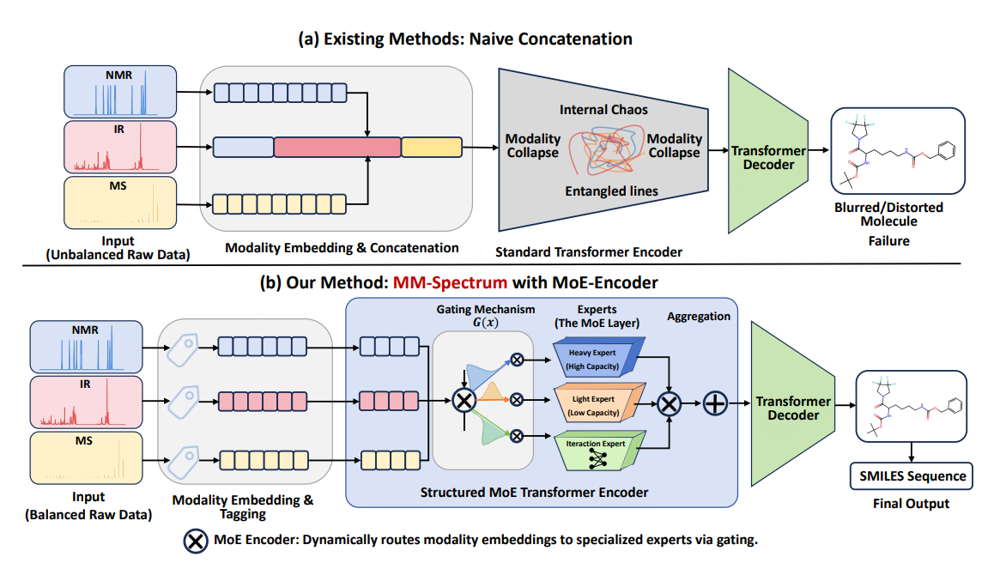

# MM-Spectrum: Multimodal Spectra → SMILES with MoE


MM-Spectrum is a research for **molecular structure prediction and conditional generation** from **multiple spectroscopic modalities** (e.g., ¹H NMR, ¹³C NMR, IR, MS).  
This repository is built on top of the widely used benchmark **Multimodal Spectroscopic Dataset** and its official baselines, and extends them with **modality-aware Mixture-of-Experts (MoE)** design, improved training dynamics, and reproducible evaluation under **full-modality** and **partial-modality** (e.g., dual-modality) settings.

This repo focuses on:

- **Training**: dense baseline + MoE variants (routing, auxiliary losses, optional heterogeneous experts)
- **Inference**: beam search / n-best generation
- **Evaluation**: Top-K accuracy and modality-combination benchmarks
- **Diagnostics**: routing statistics, utilization/entropy, step-wise logs, visualization scripts
- **Reproducibility**: configs, run folders, seeds, checkpoints, CSV summaries

> This README is intentionally **engineering-first**: how to install, run, reproduce, debug, and extend.

---


## 😃 1. Highlights

**MM-Spectrum** targets realistic multimodal spectroscopy modeling challenges:

- **Multimodal spectra → structure** translation (SMILES / canonical forms).
- **Full-modality** training + **partial-modality inference** (dual-modality subsets, missing modalities).
- **Modality-aware MoE routing** to mitigate *modality imbalance* and improve expert specialization.
- **Interpretable training diagnostics**: routing utilization, layer×expert occupancy, balance metrics, aux-loss curves.
- **Benchmark-compatible** scripts and data formats for reproducibility.

---

## 💭 2. Benchmark Lineage

This project is an extension of the benchmark codebase:

- **Benchmark Repo (Official)**: `rxn4chemistry/multimodal-spectroscopic-dataset`  
  It provides:
  - a standardized dataset release + download scripts,
  - data generation scripts (`benchmark/generate_input.py`),
  - baseline training scripts (including transformer baselines built with OpenNMT),
  - evaluation conventions for spectroscopy-to-structure and structure-to-spectra tasks.

MM-Spectrum keeps the benchmark’s **dataset format and preprocessing interfaces**, but replaces/extends the transformer backbone with **MoE-enhanced modules**.

---

## ⭐ 3. Method Overview (MM-Spectrum)

### 3.1 Problem Setting

Given one or more spectral modalities (e.g., NMR/IR/MS), the model predicts the target molecular representation (e.g., SMILES).  
We evaluate:

- **Full-modality**: all modalities present at inference.
- **Partial-modality**: only subsets are available (e.g., NMR+IR, IR+MS, etc.).
- **Cross-source / heterogeneous modality distributions**: different sources can yield different modality quality, resolution, sparsity, and coverage.

### 3.2 Key Idea: Modality-Aware MoE for Spectral Tokens

MM-Spectrum introduces a **modality-aware MoE feed-forward block** into the transformer:

- **Routing conditioned on modality identity** (explicit modality embeddings / biases).
- **Specialized experts** for different modality statistics and token distributions.
- Optional regularizers and logging hooks to analyze:
  - token-to-expert assignment distribution,
  - per-layer expert occupancy,
  - load-balancing, entropy, coefficient of variation,
  - auxiliary losses and stability over steps.



---

## 🚩 4. Requirements

### 4.1 System
- Linux recommended
- NVIDIA GPU recommended
- CUDA version compatible with your PyTorch build

### 4.2 Python environment

**Recommended**: Python 3.10+

```bash
conda create -n mmspectrum python=3.10 -y
conda activate mmspectrum
pip install -r requirements.txt
```python

---

## 🎈 5. Data format

### 5.1 OpenNMT corpora basics

OpenNMT seq2seq typically expects parallel text:
	•	*.src: source sequence (spectra tokens)
	•	*.tgt: target sequence (SMILES tokens)

Each line is one example.

### 5.2 Multimodal source formatting (recommended)

To keep engineering simple and reproducible, represent each modality as a tagged segment:
```bash
<NMR> ...tokens... </NMR> <IR> ...tokens... </IR> <MS> ...tokens... </MS>
```

If you support missing-modality evaluation, you can:
	•	drop segments at preprocessing time, or
	•	keep tags but replace content with a <MISSING> token.

### 5.3 Tokenization

This repo assumes preprocessing produces space-separated tokens.
Common choices:
	•	Binned peaks → integer/quantized tokens
	•	Special tokens for separators / modality tags
	•	SMILES tokenization can be character-level or learned BPE depending on your config

---

## ✨ 6. Training

### 6.1 Standard training entry

The repo typically uses a wrapper (e.g., benchmark/start_training.py) that:
	•	copies YAML template into the run folder
	•	fills in save_data, src_vocab, tgt_vocab, corpus paths
	•	runs onmt_train with consistent logging
	•	saves CSV summaries per step

### 6.2 Key config fields you should verify

Because OpenNMT configs can silently ignore wrong keys, always verify:
	•	Data:
	•	data.corpus_1.path_src, path_tgt
	•	data.valid.path_src, path_tgt
	•	Length / truncation (critical in spectra):
	•	src_seq_length, tgt_seq_length (or equivalent in your fork)
	•	src_seq_length_trunc, tgt_seq_length_trunc
	•	Training schedule:
	•	train_steps, valid_steps, save_checkpoint_steps
	•	learning_rate, warmup_steps, decay_method
	•	Batch:
	•	batch_type (tokens vs sents)
	•	batch_size, accum_count 

### 6.3 Outputs

Each run folder should contain:
	•	config.yaml (final resolved config)
	•	train.log
	•	checkpoints:
	•	model_step_XXXX.pt
	•	CSV summaries (if enabled):
	•	train_steps.csv
	•	valid_summary.csv
	•	MoE stats:
	•	moe_steps.csv, moe_aux.csv (names may differ in your repo)

---

## ⏰ 7. MoE implementation notes

This section is intentionally engineering-level: where to look and what to be careful about.

### 7.1 Where MoE lives

Typical OpenNMT-style integration points:
	•	Transformer encoder FFN block replacement
	•	Router module (Top-k gating) + expert FFNs
	•	Auxiliary losses (load balancing, importance, entropy, cost)

You should expect code in modules like:
	•	modules/*moe*.py
	•	encoders/transformer.py (FFN block)
	•	trainer.py (loss aggregation / normalization)
	•	utils/logging.py (CSV export)

### 7.2 Common correctness pitfalls (check these first)
	1.	Aux loss scaling
Make sure MoE aux losses are not accidentally divided twice by token normalization.
	2.	Dropout / layernorm placement
Ensure MoE FFN output matches the dense FFN interface (shape, residual, LN order).
	3.	Capacity / overflow behavior
If tokens exceed expert capacity, decide:
	•	drop tokens
	•	route to backup expert
	•	apply overflow to next-best
This impacts stability and speed.
	4.	Train vs inference routing mismatch
Ensure router uses consistent temperature, top-k, and deterministic mode for eval.

### 7.3 What to log for MoE debugging

At minimum per step:
	•	expert load / importance
	•	utilization entropy
	•	overflow / dropped token ratio
	•	router temperature / top-k
	•	aux loss values

---

## 🧠 8. Logging & diagnostics

### 8.1 Standard logs

A good run folder should include:
	•	train.log (OpenNMT console log)
	•	train_steps.csv: step-wise loss/ppl/lr/tokens/sec
	•	valid_summary.csv: validation metrics per checkpoint

### 8.2 MoE logs

If enabled:
	•	moe_steps.csv: per-step routing statistics
	•	moe_aux.csv: aux loss components over time

### 8.3 Anomaly report

Optional script to automatically flag:
	•	sudden throughput drops
	•	NaN/Inf spikes
	•	expert collapse (entropy → 0)
	•	imbalance explosion (one expert dominates)


